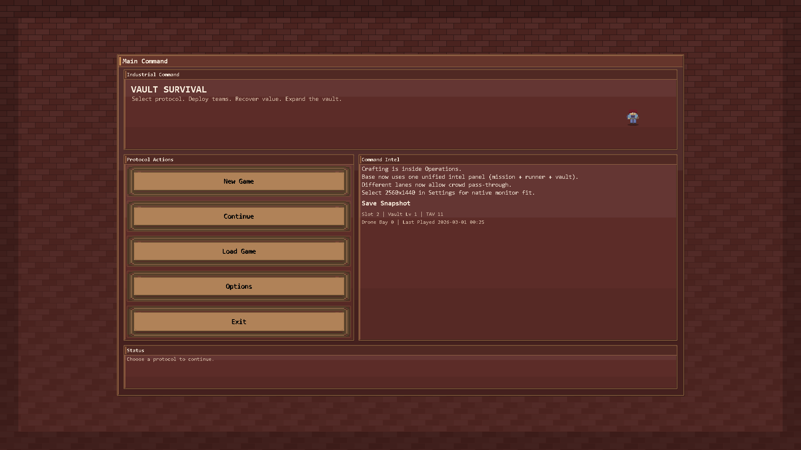
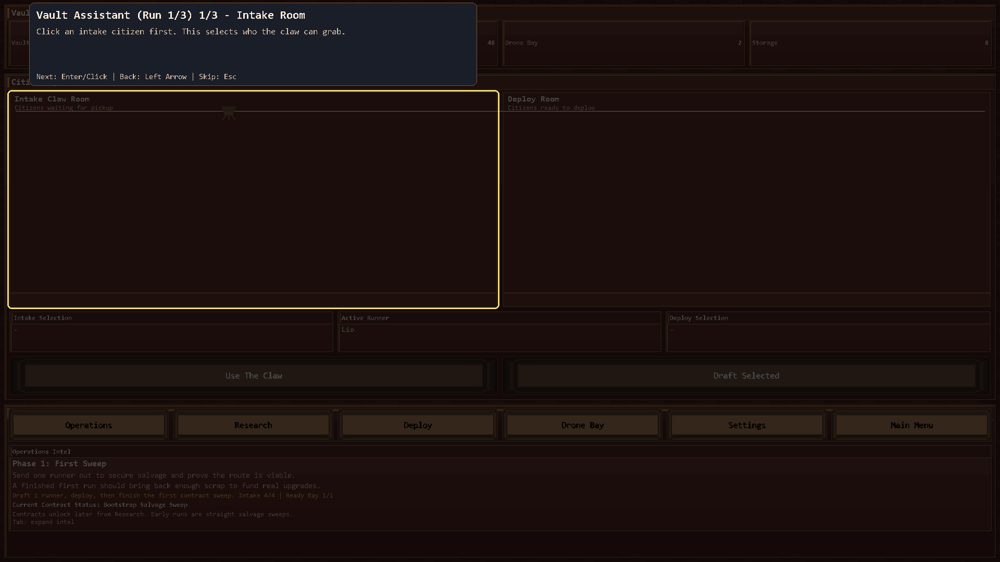
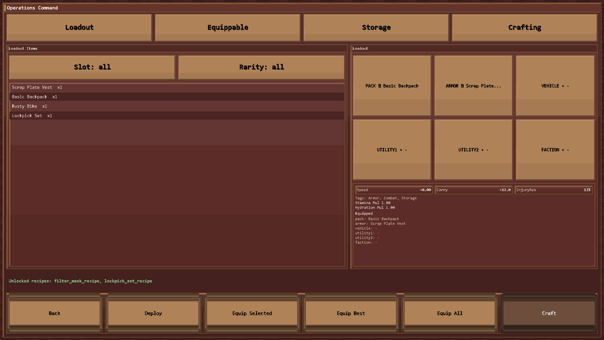
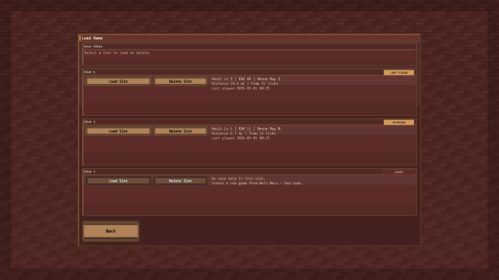

# Vault Survival — Wraith's Version ⚰️

A polished **pygame roguelite prototype** with deterministic runs, persistent save slots, vault progression, and a cleaner UX pass focused on readability + flow.

---

## 📸 Screenshots

### Main Command

### Base Operations Deck

### Operations Loadout + Gear UX

### Save Slot Manager (Load + Delete)

---

## ✅ Wraith Patch Pass (12-point UX + bugfix sweep)

This branch includes a full pass on the issues list:

1. **Font readability pass** (less heavy button/display rendering)
2. **Delete-save support** directly in slot cards with confirmation
3. **Starter character uniqueness** (prevents duplicate starters)
4. **Swapped button positions** for **Use The Claw** ↔ **Draft Selected**
5. **Fullscreen startup behavior** hardened (default fullscreen + centered boot)
6. **Button style uniformity** improved across key scenes
7. **Load Game + Equip Selected** moved onto consistent styled button pipeline
8. **Bottom context tabs removed** from Base (replaced by unified intel card)
9. **Loadout equip feedback upgraded** (clear success messaging + slot indicators)
10. **Removed redundant Craftables tab** (craft flow consolidated under Crafting)
11. **Item-loss guardrails** when no active drafted citizen is selected
12. **Hack-job cleanup pass** in scene/state flow and UI consistency paths

---

## 🕹️ Core Flow

`Intro → Main Menu → New/Load → Base → Operations (Loadout/Equippable/Storage/Crafting) → Briefing → Run → Result`

---

## ⚙️ Quickstart (Windows)

1. Create venv
   - `py -3.11 -m venv .venv`
2. Install deps
   - `.venv\Scripts\python -m pip install -r requirements.txt`
3. Run game
   - `.venv\Scripts\python -m bit_life_survival.app.main`

---

## 🎛️ Controls

### Base
- `U` Use The Claw
- `Enter` Draft Selected
- `L` Operations
- `D` Deploy
- `B` Drone Bay
- `S` Settings
- `H` Help

### Operations
- Top tabs: `Loadout / Equippable / Storage / Crafting`
- Actions: `E` Equip Selected, `B` Equip Best, `A` Equip All, `D` Deploy, `Esc` Back

### Run
- `C` Continue
- `L` Log
- `R` Retreat
- `E` Use Aid
- `Q` Quit
- `H` Help

---

## 🧰 Utility Scripts

- One-click launcher: `tools\run_game.cmd`
- Desktop shortcut installer: `powershell -ExecutionPolicy Bypass -File tools\install_shortcut.ps1`
- Screenshot generator (README assets):
  - `.venv\Scripts\python tools\generate_readme_screenshots.py`

---

## 🗂️ Data Paths (Windows)

- Install target: `C:\BitLifeSurvival\Vault_Bit_Survival\`
- Runtime data default: `C:\BitLifeSurvival\`
  - Saves: `C:\BitLifeSurvival\saves`
  - Logs: `C:\BitLifeSurvival\logs`
  - Config: `C:\BitLifeSurvival\config`

Fallback order when `C:\BitLifeSurvival` is unavailable:
1. `%LOCALAPPDATA%\BitLifeSurvival`
2. `%USERPROFILE%\BitLifeSurvival`

---

## 📚 Docs

- `docs/PHASE1_VERTICAL_SLICE.md`
- `docs/INTRO_BBWG.md`
- `docs/PHASE0_FOUNDATION.md`
