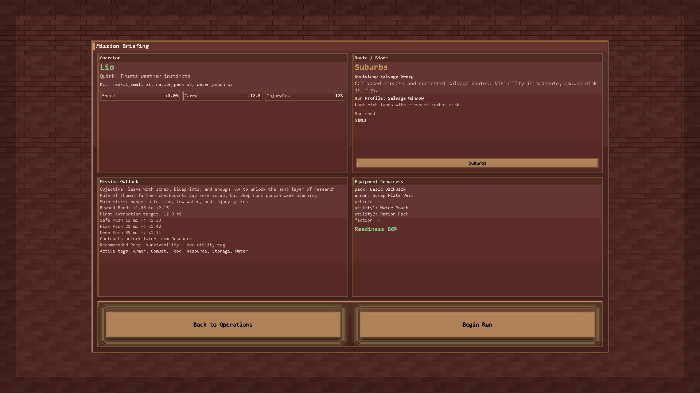
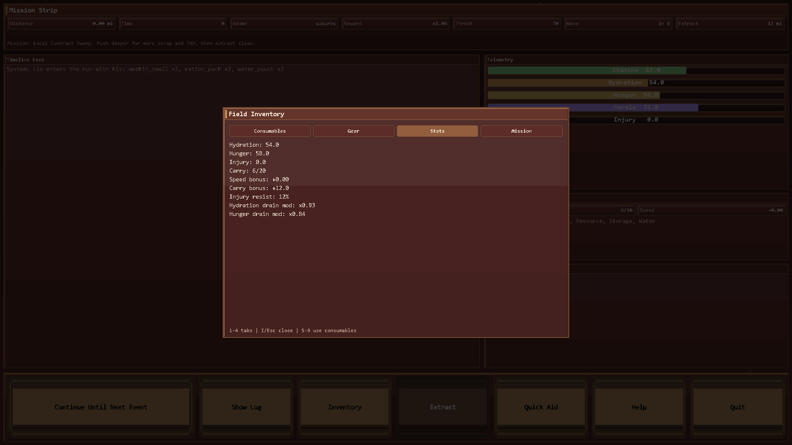
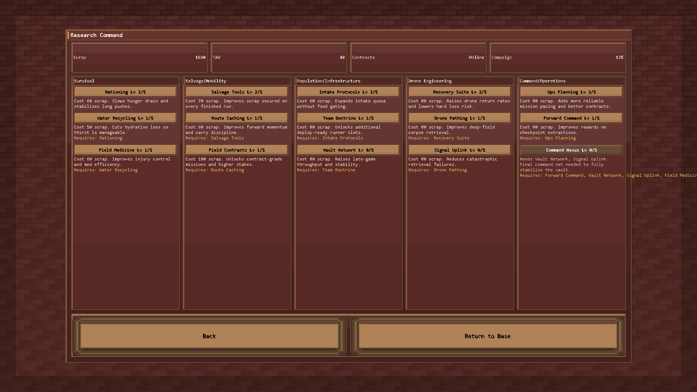

# Vault Survival - Wraith's Version

A pixel-survival roguelite where the Vault chooses you, locks the doors, and sends you out to bring value back.

This version focuses on high-clarity progression: tighter run decisions, stronger mission identity, and a research tree that drives long-term growth without breaking the early game.

---

## Why this version feels better

- Clear run purpose: you know why you are deploying, what you are chasing, and what deeper pushes unlock.
- Stronger run gameplay: in-run inventory and actionable survival choices instead of passive button spam.
- Progression that scales: research branches gate power and open contracts over time.
- Better death loop: drone recovery explains exactly what came back and what was lost.
- Cleaner state handling: dead runners never reappear as fake deploy-ready operators.

---

## Screenshot tour

### Main Command Hub

### Base Operations Deck

### Mission Briefing (Purpose + Risk + Reward)

### Field Run with Inventory Overlay

### Operations Loadout and Gear Prep

### Research Command Tree

### Save Slot Manager (Load + Delete)

---

## Core gameplay loop

`Main Menu -> New/Load -> Base -> Research / Operations / Drone Bay -> Briefing -> Run -> Recovery -> Repeat`

You are building toward campaign completion by growing TAV, unlocking contracts, and investing scrap into research branches.

---

## Major systems in this build

1. No-retreat standard run flow
   - Runs push toward extraction checkpoints and objective completion.

2. In-run inventory (`I`)
   - Tabs for consumables, gear, stats, and mission tracking.
   - Field use actions for food, water, aid, and utility handling.

3. Survival pressure tuning
   - Hunger is now part of run pressure.
   - Hydration pacing is less oppressive and more readable.

4. Research Command
   - Five branches with dependencies and max level 5 nodes.
   - Cost formula rises by `+20 scrap` each level.
   - Deploy capacity starts at 1 and expands through research.
   - Contract routes unlock later through research progression.

5. Drone recovery redesign
   - Baseline recovery starts low and scales with drone upgrades.
   - Recovery report clearly shows recovered loot vs losses.

6. Runner state reliability
   - Fallen operators are moved out of deploy-ready paths.
   - No ghost runner bug after death.

---

## Controls

### Base
- `U` Use The Claw
- `Enter` Draft Selected
- `L` Operations
- `R` Research
- `D` Deploy
- `B` Drone Bay
- `S` Settings
- `H` Help

### Operations
- Tabs: `Loadout / Equippable / Storage / Crafting`
- Actions: `E` Equip Selected, `B` Equip Best, `A` Equip All, `D` Deploy, `Esc` Back

### Run
- `C` Continue
- `I` Inventory
- `E` Quick Aid
- `L` Log
- `X` Extract
- `H` Help
- `Q` Quit

---

## Quickstart (Windows)

1. Create venv
   - `py -3.11 -m venv .venv`
2. Install deps
   - `.venv\Scripts\python -m pip install -r requirements.txt`
3. Launch
   - `.venv\Scripts\python -m bit_life_survival.app.main`

Quick launcher:
- `Launch_Vault_Survival.bat`

---

## Utility scripts

- One-click runner: `tools\run_game.cmd`
- Desktop shortcut installer: `powershell -ExecutionPolicy Bypass -File tools\install_shortcut.ps1`
- Refresh README screenshots:
  - `.venv\Scripts\python tools\generate_readme_screenshots.py`

---

## Data paths (Windows)

- Install target: `C:\BitLifeSurvival\Vault_Bit_Survival\`
- Runtime data default: `C:\BitLifeSurvival\`
  - Saves: `C:\BitLifeSurvival\saves`
  - Logs: `C:\BitLifeSurvival\logs`
  - Config: `C:\BitLifeSurvival\config`

Fallback order if `C:\BitLifeSurvival` is unavailable:
1. `%LOCALAPPDATA%\BitLifeSurvival`
2. `%USERPROFILE%\BitLifeSurvival`

---

## Docs

- `docs/PHASE1_VERTICAL_SLICE.md`
- `docs/INTRO_BBWG.md`
- `docs/PHASE0_FOUNDATION.md`
